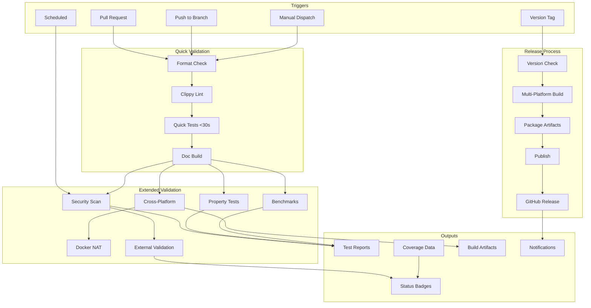

# CI/CD Architecture

## Overview

The ant-quic CI/CD pipeline is designed as a modular, extensible system that ensures code quality, security, and compatibility across multiple platforms.

## Pipeline Flow



## Workflow Categories

### 1. Continuous Integration (Every PR/Push)
- **quick-checks.yml**: Format, lint, quick tests
- **cross-platform.yml**: Platform compatibility
- **security.yml**: Vulnerability scanning

### 2. Scheduled Tasks
- **external-validation.yml**: Daily endpoint testing
- **benchmarks.yml**: Weekly performance tracking
- **security.yml**: Daily vulnerability checks

### 3. Release Automation
- **release-enhanced.yml**: Tag-triggered releases
- **coverage.yml**: Coverage reporting

### 4. Specialized Testing
- **property-tests.yml**: Randomized testing
- **docker-nat-tests.yml**: NAT traversal scenarios

## Key Design Principles

### 1. Fail Fast
Quick checks run first to catch common issues early:
```yaml
needs: [format, lint]  # Don't run expensive tests if basics fail
```

### 2. Parallelization
Independent jobs run concurrently:
```yaml
strategy:
  matrix:
    os: [ubuntu-latest, macos-latest, windows-latest]
```

### 3. Caching
Aggressive caching for dependencies:
```yaml
cache:
  key: ${{ runner.os }}-cargo-${{ hashFiles('**/Cargo.lock') }}
```

### 4. Modularity
Each workflow has a single responsibility, making them:
- Easy to understand
- Simple to debug
- Reusable

### 5. Conditional Execution
Run expensive operations only when needed:
```yaml
if: |
  github.event_name == 'push' ||
  contains(github.event.pull_request.labels.*.name, 'benchmark')
```

## Resource Optimization

### Concurrency Control
```yaml
concurrency:
  group: ${{ github.workflow }}-${{ github.ref }}
  cancel-in-progress: true
```

### Timeout Management
```yaml
timeout-minutes: 30  # Workflow level
steps:
  - timeout-minutes: 10  # Step level
```

### Artifact Retention
```yaml
retention-days: 7  # Don't keep forever
```

## Security Considerations

1. **Secrets are never logged** - GitHub masks them automatically
2. **Third-party actions are pinned** - Use SHA instead of tags
3. **Minimal permissions** - Workflows request only needed permissions
4. **Dependabot updates** - Keep actions up to date

## Monitoring and Metrics

### Key Metrics Tracked
- Workflow success rate
- Average execution time
- Test coverage trends
- Security vulnerability count
- Platform-specific pass rates

### Dashboards Available
- GitHub Actions tab (built-in)
- CI Dashboard (docs/ci-dashboard.html)
- Codecov.io (coverage trends)
- Security tab (vulnerability alerts)

## Extensibility

### Adding New Workflows
1. Create `.github/workflows/new-workflow.yml`
2. Follow naming conventions
3. Include standard environment variables
4. Add to documentation
5. Update dashboard if needed

### Integration Points
- Status checks for PR merge requirements
- Webhook notifications for external services
- API access for custom tooling
- Badge generation for README

## Cost Optimization

### GitHub Actions Minutes
- Public repo: Unlimited for public runners
- Private repo: Limited by plan

### Optimization Strategies
1. Use workflow conditions to skip unnecessary runs
2. Leverage caching to reduce build times
3. Run expensive tests only on main branch
4. Use concurrency limits to prevent parallel runs

## Future Improvements

- [ ] Self-hosted runners for better performance
- [ ] GPU runners for specialized tests
- [ ] Integration with external monitoring
- [ ] Advanced caching strategies
- [ ] Multi-region testing infrastructure