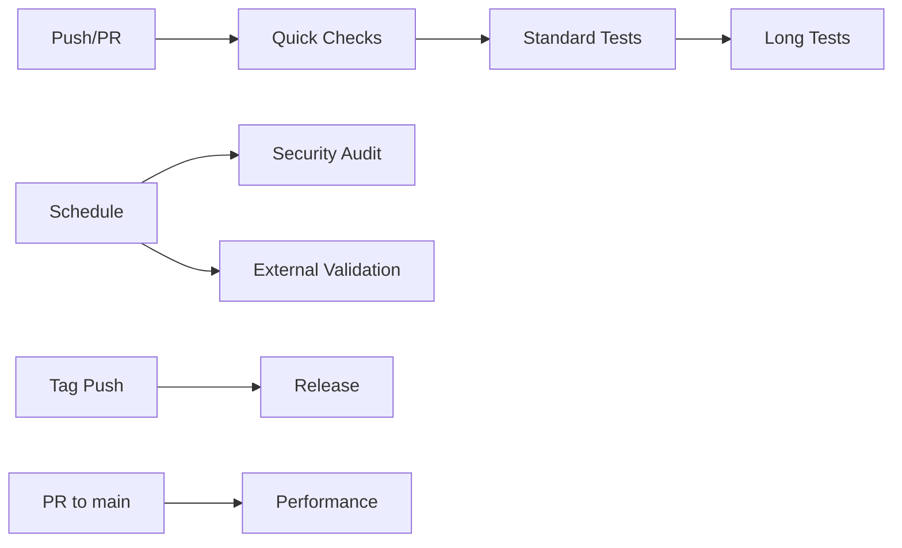

# ant-quic CI/CD Workflows

This directory contains the GitHub Actions workflows for the ant-quic project. The workflows are designed to be modular, maintainable, and provide comprehensive testing across all platforms.

## Workflow Overview

### 🚀 Quick Checks (`quick-checks.yml`)
**Trigger**: Every push and PR
**Duration**: <5 minutes
**Purpose**: Fast feedback on code quality

Checks:
- Code formatting (rustfmt)
- Linting (clippy)
- Quick unit tests (<30s)
- Compilation on all platforms
- YAML/TOML validation

### 🧪 Standard Tests (`standard-tests.yml`)
**Trigger**: After quick checks pass
**Duration**: <10 minutes
**Purpose**: Comprehensive test coverage

Tests:
- All unit and integration tests
- Documentation tests
- Feature combination tests
- WASM compatibility
- Code coverage generation

### 🏋️ Long Tests (`long-tests.yml`)
**Trigger**: Daily schedule, manual, or PR label
**Duration**: 30-60 minutes
**Purpose**: Exhaustive testing

Suites:
- NAT traversal scenarios
- Docker-based NAT simulation
- Stress tests
- Cross-platform matrix
- Property-based tests

### 🔒 Security Audit (`security-audit.yml`)
**Trigger**: Daily or on dependency changes
**Duration**: <10 minutes
**Purpose**: Security and compliance

Scans:
- Vulnerability scanning (cargo-audit)
- License compliance (cargo-deny)
- Unsafe code analysis (cargo-geiger)
- SBOM generation
- Static analysis (Semgrep)

### 📊 Performance (`performance.yml`)
**Trigger**: PRs to main branch
**Duration**: <20 minutes
**Purpose**: Prevent performance regressions

Benchmarks:
- Connection establishment
- Throughput tests
- Frame parsing
- Memory usage analysis
- Regression detection (5% threshold)

### 📦 Release (`release.yml`)
**Trigger**: Version tags (v*)
**Duration**: <30 minutes
**Purpose**: Automated releases

Steps:
1. Validate version format
2. Run final tests (reuses quick checks)
3. Build binaries for all platforms
4. Generate release notes
5. Create GitHub release with artifacts

Note: Docker images and crates.io publishing are not part of the current workflow.

### 🌐 External Validation (`scheduled-external.yml`)
**Trigger**: Daily at 4 AM UTC
**Duration**: <15 minutes
**Purpose**: Real-world validation

Tests:
- Public QUIC endpoints
- Interoperability matrix
- RFC compliance checks
- Success rate tracking

## Workflow Dependencies



## Running Workflows Locally

You can test workflows locally using [act](https://github.com/nektos/act):

```bash
# Run quick checks
act -j quick-checks

# Run with specific event
act pull_request -j standard-tests

# Run with secrets
act -s GITHUB_TOKEN=$GITHUB_TOKEN
```

## Triggering Long Tests

Long tests can be triggered in several ways:

1. **Scheduled**: Runs automatically every day at 2 AM UTC
2. **Manual**: Go to Actions tab → Long Tests → Run workflow
3. **PR Label**: Add the `run-long-tests` label to a PR

## Configuration

### Test Timeouts
- Quick tests: 30 seconds
- Standard tests: 5 minutes
- Long tests: 30-60 minutes

### Performance Thresholds
- Regression threshold: 5%
- Improvement threshold: 5%

### Platform Matrix
- OS: Ubuntu, Windows, macOS
- Architectures: x86_64, aarch64
- Rust: stable, beta, nightly (allowed to fail)

## Secrets Required

The following secrets need to be configured in the repository:

- `CRATES_IO_TOKEN`: For publishing to crates.io
- `DOCKER_USERNAME`: Docker Hub username
- `DOCKER_PASSWORD`: Docker Hub password

## Troubleshooting

### Common Issues

1. **Workflow not triggering**
   - Check branch protection rules
   - Verify workflow syntax with `actionlint`
   - Check GitHub Actions status

2. **Tests timing out**
   - Increase timeout in workflow
   - Check for deadlocks in tests
   - Consider moving to long tests

3. **Release failing**
   - Ensure version tag matches Cargo.toml
   - Check crates.io token validity
   - Verify all tests pass

### Debugging

Enable debug logging:
```yaml
env:
  ACTIONS_RUNNER_DEBUG: true
  ACTIONS_STEP_DEBUG: true
```

## Contributing

When adding new workflows:

1. Keep workflows focused and modular
2. Use reusable actions in `.github/actions/`
3. Document trigger conditions and purpose
4. Add appropriate timeouts
5. Include error handling and retries
6. Update this README

## Monitoring

- Check Actions tab for workflow runs
- Review workflow insights for trends
- Monitor security alerts
- Track performance metrics over time
