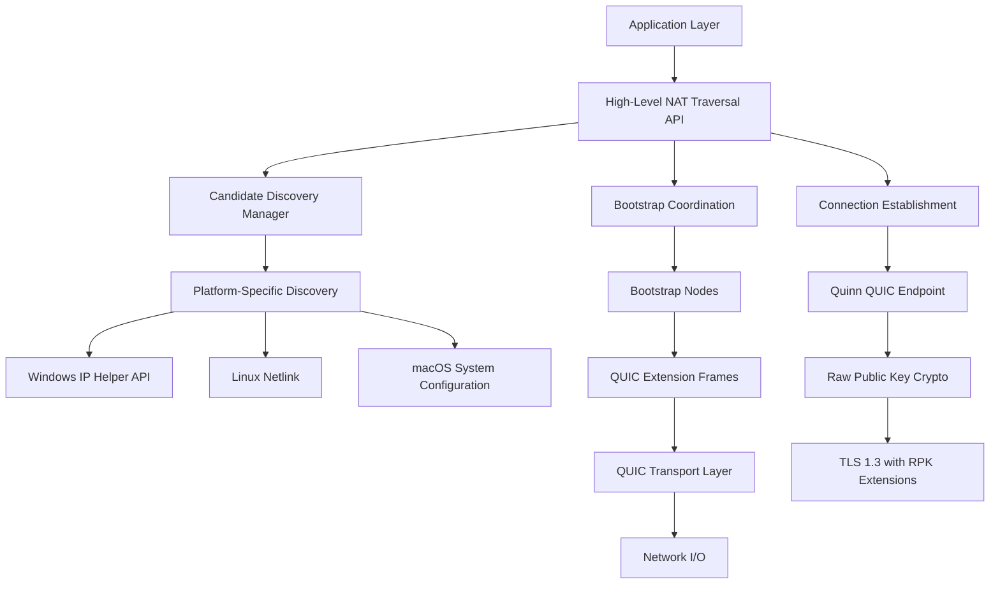
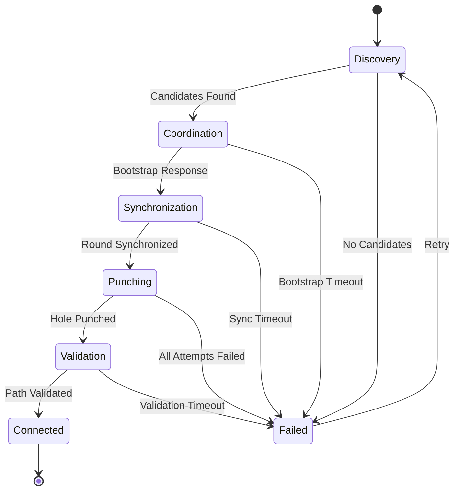

# Design Document

## Overview

The ant-quic completion design focuses on implementing the missing core functionality to transform the current well-architected foundation into a production-ready P2P QUIC implementation. The design follows the QUIC-native approach from draft-seemann-quic-nat-traversal-01 and integrates RFC 7250 Raw Public Keys for P2P authentication.

The implementation strategy prioritizes completing the existing architecture rather than rebuilding, leveraging the solid foundation already present in the quinn-proto fork.

## Architecture

### High-Level Architecture



### NAT Traversal Protocol Stack

The design implements the QUIC-native approach from draft-seemann-quic-nat-traversal-01:

1. **Transport Parameter Negotiation**: `nat_traversal` parameter (0x3d7e9f0bca12fea6)
2. **Extension Frames**: ADD_ADDRESS (0x40), PUNCH_ME_NOW (0x41), REMOVE_ADDRESS (0x42)
3. **Coordination Protocol**: Round-based synchronization via bootstrap nodes
4. **Path Validation**: QUIC PATH_CHALLENGE/PATH_RESPONSE integration

### Raw Public Key Integration

Following RFC 7250 with SubjectPublicKeyInfo format:
- TLS extension negotiation for certificate types
- Ed25519 public key extraction and validation
- Peer identity mapping from public keys
- Backward compatibility with X.509 certificates

## Components and Interfaces

### 1. QUIC Extension Frames Implementation

**Location**: `src/frame.rs` ✅ **ALREADY IMPLEMENTED**

The NAT traversal frames are already fully implemented with:
- Frame type constants: ADD_ADDRESS (0x40), PUNCH_ME_NOW (0x41), REMOVE_ADDRESS (0x42)
- Complete frame structures with proper encoding/decoding
- IPv4 and IPv6 support with proper address handling
- VarInt encoding for all fields
- Integration with the main frame system

**Current Implementation Status**:
- ✅ AddAddress frame with sequence, address, priority
- ✅ PunchMeNow frame with round, target_sequence, local_address, optional target_peer_id
- ✅ RemoveAddress frame with sequence
- ✅ Frame encoding/decoding with proper error handling
- ✅ Integration with Frame enum and frame iteration

**Remaining Work**: None - frames are complete and ready to use

### 2. Platform-Specific Network Discovery

**Location**: `src/candidate_discovery/` (complete platform implementations)

```rust
// Platform-specific discovery traits
pub trait NetworkInterfaceDiscovery {
    fn discover_interfaces(&self) -> Result<Vec<NetworkInterface>, DiscoveryError>;
    fn get_default_route(&self) -> Result<Option<SocketAddr>, DiscoveryError>;
}

// Platform implementations
pub struct WindowsDiscovery; // IP Helper API
pub struct LinuxDiscovery;   // Netlink sockets  
pub struct MacOSDiscovery;   // System Configuration framework
```

**Key Design Decisions**:
- Use native platform APIs for accurate interface discovery
- Implement proper error handling for each platform
- Support both IPv4 and IPv6 interface enumeration
- Cache interface information with appropriate refresh intervals

### 3. Bootstrap Coordination Protocol

**Location**: `src/connection/nat_traversal.rs` ✅ **PARTIALLY IMPLEMENTED**

The bootstrap coordination infrastructure is already well-established with:
- ✅ BootstrapCoordinator struct with peer registry and coordination sessions
- ✅ PeerObservationRecord for tracking observed addresses
- ✅ CoordinationSession management with round-based protocol
- ✅ Security validation state and statistics tracking
- ✅ Address observation caching and validation

**Current Implementation Status**:
- ✅ Core data structures and state management
- ✅ Peer address observation infrastructure
- ✅ Coordination session lifecycle management
- ✅ Security validation framework
- 🚧 **NEEDS COMPLETION**: Actual coordination logic implementation
- 🚧 **NEEDS COMPLETION**: Frame relay between coordinating peers
- 🚧 **NEEDS COMPLETION**: Rate limiting and security enforcement

**Remaining Work**: Complete the coordination protocol implementation and frame relay logic

### 4. Real QUIC Connection Integration

**Location**: `src/nat_traversal_api.rs` (complete Quinn integration)

```rust
pub struct NatTraversalEndpoint {
    quinn_endpoint: QuinnEndpoint,
    discovery_manager: CandidateDiscoveryManager,
    coordination_state: CoordinationState,
    active_connections: HashMap<PeerId, QuinnConnection>,
}
```

**Key Design Decisions**:
- Replace placeholder implementations with real Quinn connections
- Integrate NAT traversal state with Quinn's connection lifecycle
- Implement proper connection establishment flow
- Add connection migration support after successful traversal

### 5. Raw Public Key Crypto System

**Location**: `src/crypto/raw_public_keys.rs` ✅ **ALREADY IMPLEMENTED**

The Raw Public Key system is already extensively implemented with:
- ✅ RawPublicKeyVerifier and RawPublicKeyResolver
- ✅ Ed25519 key generation and SubjectPublicKeyInfo encoding/decoding
- ✅ TLS extension negotiation for certificate types
- ✅ Certificate type negotiation (client_certificate_type, server_certificate_type)
- ✅ Integration with rustls dangerous configuration
- ✅ Configuration builders and utilities

**Current Implementation Status**:
- ✅ Complete RFC 7250 certificate type negotiation
- ✅ Ed25519 key support with proper OID handling (1.3.101.112)
- ✅ SubjectPublicKeyInfo creation and parsing
- ✅ TLS extension handling and negotiation
- ✅ Configuration builders for easy setup
- ✅ Backward compatibility with X.509 certificates
- ✅ Integration with Quinn and rustls
- ✅ Comprehensive test coverage

**Remaining Work**: None - Raw Public Key system is complete and production-ready

## Data Models

### NAT Traversal State Machine



### Candidate Priority Calculation

Following ICE-like algorithms:
```
Priority = (2^24) * type_preference + 
           (2^8) * local_preference + 
           (2^0) * component_id
```

Where:
- `type_preference`: Host (126) > Server Reflexive (100) > Relay (0)
- `local_preference`: Interface-specific preference
- `component_id`: Always 1 for QUIC (single component)

### Frame Encoding Format

**ADD_ADDRESS Frame**:
```
 0                   1                   2                   3
 0 1 2 3 4 5 6 7 8 9 0 1 2 3 4 5 6 7 8 9 0 1 2 3 4 5 6 7 8 9 0 1
+-+-+-+-+-+-+-+-+-+-+-+-+-+-+-+-+-+-+-+-+-+-+-+-+-+-+-+-+-+-+-+-+
|                     Sequence Number (i)                      ...
+-+-+-+-+-+-+-+-+-+-+-+-+-+-+-+-+-+-+-+-+-+-+-+-+-+-+-+-+-+-+-+-+
|                        Priority (i)                          ...
+-+-+-+-+-+-+-+-+-+-+-+-+-+-+-+-+-+-+-+-+-+-+-+-+-+-+-+-+-+-+-+-+
|V|                    Address (variable)                      ...
+-+-+-+-+-+-+-+-+-+-+-+-+-+-+-+-+-+-+-+-+-+-+-+-+-+-+-+-+-+-+-+-+
```

Where V bit indicates IPv4 (0) or IPv6 (1).

## Error Handling

### Error Classification

1. **Transient Errors**: Network timeouts, temporary bootstrap unavailability
2. **Configuration Errors**: Invalid parameters, missing bootstrap nodes
3. **Protocol Errors**: Malformed frames, invalid state transitions
4. **Security Errors**: Rate limiting violations, validation failures

### Error Recovery Strategies

```rust
pub enum RecoveryStrategy {
    Retry { max_attempts: u32, backoff: Duration },
    Fallback { alternative: Box<dyn ConnectionStrategy> },
    Abort { reason: String },
}
```

### Graceful Degradation

- **No Bootstrap Nodes**: Fall back to direct connection attempts
- **NAT Traversal Failure**: Attempt relay connections if available
- **Platform Discovery Failure**: Use basic interface enumeration
- **Raw Key Failure**: Fall back to X.509 certificate validation

## Testing Strategy

### Unit Testing

1. **Frame Encoding/Decoding**: Test vectors for all NAT traversal frames
2. **Platform Discovery**: Mock platform APIs for consistent testing
3. **Coordination Protocol**: State machine validation with simulated network
4. **Raw Key Crypto**: Certificate type negotiation and key extraction

### Integration Testing

1. **Multi-Node Scenarios**: Simulated network topologies with different NAT types
2. **Real Network Testing**: Actual NAT traversal between test nodes
3. **Platform Compatibility**: Automated testing on Windows, Linux, macOS
4. **Performance Testing**: Connection establishment times and success rates

### Test Infrastructure

```rust
pub struct NatSimulator {
    nat_type: NatType,
    port_mapping: HashMap<SocketAddr, SocketAddr>,
    packet_filter: Box<dyn PacketFilter>,
}

pub enum NatType {
    FullCone,
    RestrictedCone,
    PortRestricted,
    Symmetric,
    CarrierGrade,
}
```

### Security Testing

1. **Rate Limiting**: Validate protection against flooding attacks
2. **Amplification Prevention**: Ensure server-initiated validation limits
3. **Address Validation**: Test protection against address scanning
4. **Frame Validation**: Malformed frame handling and rejection

## Performance Considerations

### Memory Optimization

- **Connection Pooling**: Reuse Quinn connections where possible
- **Candidate Caching**: Cache discovered candidates with TTL
- **Frame Batching**: Batch multiple frames in single packets
- **State Cleanup**: Automatic cleanup of expired sessions

### Network Efficiency

- **Parallel Discovery**: Concurrent candidate discovery across interfaces
- **Adaptive Timeouts**: Dynamic timeout adjustment based on network conditions
- **Connection Migration**: Seamless path switching after traversal
- **Bandwidth Management**: Respect QUIC congestion control during traversal

### Scalability Targets

- **Concurrent Sessions**: Support 1000+ simultaneous NAT traversal attempts
- **Bootstrap Load**: Handle 10,000+ coordination requests per second
- **Memory Usage**: <100MB for typical P2P node deployment
- **Connection Establishment**: <2 seconds average for successful traversal

## Security Architecture

### Rate Limiting Implementation

```rust
pub struct AdaptiveRateLimiter {
    token_bucket: TokenBucket,
    reputation_tracker: ReputationTracker,
    adaptive_limits: AdaptiveLimits,
}
```

### Address Validation

- **Source Address Verification**: Validate frame source matches connection
- **Candidate Reachability**: Verify advertised addresses are reachable
- **Amplification Prevention**: Limit server-initiated validation packets
- **Replay Protection**: Use sequence numbers and timestamps

### Cryptographic Security

- **Secure Random**: Use cryptographically secure RNG for coordination rounds
- **Key Validation**: Proper Ed25519 public key validation
- **Certificate Binding**: Ensure peer ID matches certificate/key
- **Forward Secrecy**: Leverage QUIC's built-in forward secrecy

This design provides a comprehensive roadmap for completing the ant-quic implementation while maintaining the existing architectural strengths and ensuring production readiness.