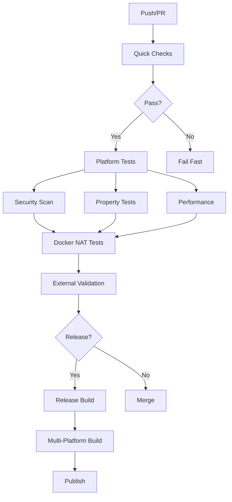

# ant-quic CI/CD Guide

## Overview

ant-quic uses a comprehensive GitHub Actions-based CI/CD pipeline designed for reliability, performance, and security. The pipeline is modular, with specialized workflows for different aspects of quality assurance.

## Architecture



## Workflows

### Core Workflows

#### 1. Quick Checks (`.github/workflows/quick-checks.yml`)
**Trigger**: Every push and PR
**Duration**: < 2 minutes
**Purpose**: Fast feedback on basic issues

- Code formatting (`cargo fmt`)
- Linting (`cargo clippy`)
- Quick unit tests (< 30s)
- Documentation build check

#### 2. Cross-Platform Tests (`.github/workflows/cross-platform.yml`)
**Trigger**: PR and main branch
**Duration**: 15-30 minutes
**Purpose**: Ensure compatibility across platforms

Platforms tested:
- Linux (x86_64, ARM64)
- macOS (Intel, Apple Silicon)
- Windows (MSVC, GNU)
- Android (via cargo-ndk)
- iOS (build only)
- WASM (wasm32-unknown-unknown)

#### 3. Security Scanning (`.github/workflows/security.yml`)
**Trigger**: Daily and on PR
**Duration**: 5-10 minutes
**Purpose**: Identify vulnerabilities

- `cargo audit` for known CVEs
- `cargo deny` for license compliance
- Dependency verification
- SARIF report generation

#### 4. Property-Based Testing (`.github/workflows/property-tests.yml`)
**Trigger**: PR and nightly
**Duration**: 30-60 minutes
**Purpose**: Find edge cases through randomized testing

Test categories:
- Frame encoding/decoding
- NAT traversal state machines
- Connection establishment
- Transport parameter validation

#### 5. Performance Monitoring (`.github/workflows/benchmarks.yml`)
**Trigger**: PR and weekly
**Duration**: 20-40 minutes
**Purpose**: Prevent performance regressions

- Criterion benchmarks
- Historical comparison
- Regression alerts
- Performance trends

### Specialized Workflows

#### 6. Docker NAT Testing (`.github/workflows/docker-nat-tests.yml`)
**Trigger**: PR for NAT changes
**Duration**: 20-30 minutes
**Purpose**: Test NAT traversal scenarios

NAT types tested:
- Full Cone NAT
- Restricted NAT
- Port Restricted NAT
- Symmetric NAT
- Carrier-Grade NAT (CGNAT)

#### 7. External Validation (`.github/workflows/external-validation.yml`)
**Trigger**: Daily at 2 AM UTC
**Duration**: 5-10 minutes
**Purpose**: Verify real-world QUIC compatibility

Tests against:
- Google QUIC servers
- Cloudflare
- Meta/Facebook
- Academic test servers

#### 8. Release Automation (`.github/workflows/release-enhanced.yml`)
**Trigger**: Version tags (v*)
**Duration**: 45-60 minutes
**Purpose**: Build and publish releases

Steps:
1. Version validation
2. Changelog generation
3. Multi-platform builds (8 targets)
4. Docker image creation
5. crates.io publication
6. GitHub release creation

## Status Badges

Add these to your README:

```markdown


```

## Required Secrets

Configure these in Settings → Secrets → Actions:

| Secret | Purpose | Required |
|--------|---------|----------|
| `CARGO_REGISTRY_TOKEN` | crates.io publishing | For releases |
| `DOCKER_USERNAME` | Docker Hub login | For Docker builds |
| `DOCKER_PASSWORD` | Docker Hub password | For Docker builds |
| `DISCORD_WEBHOOK` | Release notifications | Optional |
| `CODECOV_TOKEN` | Coverage reporting | Optional |

## Adding New Workflows

1. Create workflow file in `.github/workflows/`
2. Follow naming convention: `category-name.yml`
3. Include standard metadata:
   ```yaml
   name: Descriptive Name
   
   on:
     # Define triggers
   
   env:
     RUST_BACKTRACE: 1
     CARGO_TERM_COLOR: always
   ```

4. Use caching for dependencies:
   ```yaml
   - uses: actions/cache@v4
     with:
       path: |
         ~/.cargo/bin/
         ~/.cargo/registry/index/
         ~/.cargo/registry/cache/
         ~/.cargo/git/db/
         target/
       key: ${{ runner.os }}-cargo-${{ hashFiles('**/Cargo.lock') }}
   ```

5. Add to appropriate workflow category in this guide

## Workflow Dependencies

Some workflows depend on others:

```yaml
# In dependent workflow
needs: [validate, test, security-check]
```

## Performance Optimization

### Caching Strategy
- Cargo dependencies cached by OS and Cargo.lock hash
- Docker layer caching for NAT tests
- Benchmark baseline caching

### Parallel Execution
- Matrix builds for platforms
- Concurrent test categories
- Parallel Docker container tests

### Resource Management
- Use `timeout-minutes` to prevent hanging jobs
- Implement job concurrency limits
- Use conditional steps to skip unnecessary work

## Troubleshooting

### Common Issues

#### 1. Cargo Cache Issues
```yaml
# Force cache refresh by changing key
key: ${{ runner.os }}-cargo-v2-${{ hashFiles('**/Cargo.lock') }}
```

#### 2. Platform-Specific Failures
- Check runner OS version
- Verify toolchain compatibility
- Review platform-specific dependencies

#### 3. Flaky Tests
- Add retry logic for network tests
- Increase timeouts for slower platforms
- Use test categories to isolate issues

#### 4. Docker Build Failures
```bash
# Test locally
docker compose -f docker/docker-compose.yml build
```

### Debugging Workflows

1. **Enable debug logging**:
   - Add `ACTIONS_STEP_DEBUG: true` secret
   - Add `ACTIONS_RUNNER_DEBUG: true` secret

2. **Run act locally**:
   ```bash
   # Install act
   brew install act  # or your package manager
   
   # Run workflow locally
   act push -W .github/workflows/quick-checks.yml
   ```

3. **Check runner environment**:
   ```yaml
   - name: Debug Info
     run: |
       echo "OS: ${{ runner.os }}"
       echo "Rust: $(rustc --version)"
       echo "Cargo: $(cargo --version)"
   ```

## Best Practices

1. **Keep workflows focused** - One concern per workflow
2. **Fail fast** - Quick checks before expensive operations
3. **Use matrices wisely** - Balance parallelism with resource usage
4. **Cache aggressively** - But invalidate when needed
5. **Version your actions** - Use SHA pins for security
6. **Monitor usage** - Stay within GitHub Actions limits

## CI Metrics

Track these metrics for CI health:

- **Workflow run time** - Should be stable or improving
- **Failure rate** - Should be < 5% for non-code issues
- **Cache hit rate** - Should be > 80%
- **Queue time** - Should be < 1 minute

## Integration with Development

### Pre-commit Hooks
```bash
# Install pre-commit
pip install pre-commit

# Install hooks
pre-commit install

# Run manually
pre-commit run --all-files
```

### Local Testing
```bash
# Run same checks as CI
make quick-checks
make test-cross-platform
make security
```

## Future Enhancements

- [ ] Self-hosted runners for better performance
- [ ] Integration with external code quality services
- [ ] Automated dependency updates
- [ ] Performance regression database
- [ ] CI/CD cost optimization

## Support

For CI/CD issues:
1. Check [GitHub Actions Status](https://www.githubstatus.com/)
2. Review workflow logs in Actions tab
3. Consult this guide's troubleshooting section
4. Open issue with `ci/cd` label