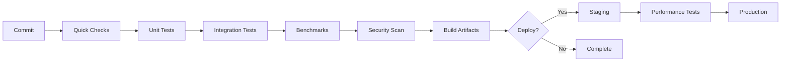

# CI/CD Operations Guide

This guide covers the continuous integration and deployment pipelines for ant-quic, including GitHub Actions workflows, deployment procedures, and operational best practices.

## Table of Contents

1. [CI/CD Overview](#cicd-overview)
2. [GitHub Actions Workflows](#github-actions-workflows)
3. [Local Development Workflow](#local-development-workflow)
4. [Deployment Pipeline](#deployment-pipeline)
5. [Monitoring and Alerts](#monitoring-and-alerts)
6. [Rollback Procedures](#rollback-procedures)
7. [Security Considerations](#security-considerations)
8. [Troubleshooting](#troubleshooting)

## CI/CD Overview

The ant-quic CI/CD pipeline ensures code quality, performance, and reliable deployments:



### Key Features

- **Automated Testing**: 580+ tests run on every commit
- **Multi-Platform**: Tests on Linux, macOS, Windows
- **Performance Tracking**: Automated benchmarks with regression detection
- **Security Scanning**: Vulnerability detection and dependency audits
- **Staged Deployment**: Staging → Performance Testing → Production
- **Automatic Rollback**: Failed deployments revert automatically

## GitHub Actions Workflows

### 1. Comprehensive CI (`comprehensive-ci.yml`)

**Trigger**: Every push and pull request

```yaml
name: Comprehensive CI
on:
  push:
  pull_request:
```

**Jobs**:

#### Quick Checks (2 min)
```bash
# What it does:
- cargo fmt --check      # Code formatting
- cargo clippy --all-features -- -D clippy::panic -D clippy::unwrap_used -D clippy::expect_used  # Linting (policy)
- cargo doc --no-deps   # Documentation build
```

#### Test Matrix (10-15 min)
```bash
# Runs on:
- OS: ubuntu-latest, macos-latest, windows-latest
- Rust: 1.85.0 (MSRV), stable, beta, nightly

# Tests:
- cargo test --all-features
- cargo test --no-default-features
```

#### Feature Tests (5-10 min)
```bash
# Test feature combinations:
- default features
- --features "pqc aws-lc-rs"
- --features "pqc rustls-ring"
- --no-default-features --features "rustls-ring"
```

### 2. NAT Traversal Tests (`nat_traversal_tests.yml`)

**Trigger**: Changes to NAT-related code

```yaml
on:
  push:
    paths:
      - 'src/nat_traversal/**'
      - 'src/connection/**'
      - 'src/frame.rs'
```

**Specialized Tests**:

```bash
# Unit tests
cargo test nat_traversal

# Docker NAT simulation
docker-compose -f docker/docker-compose.yml up -d
docker exec test-runner /app/run-test.sh all_nat_tests

# Stress tests
cargo test --test nat_traversal_comprehensive stress -- --ignored

# Platform-specific
cargo test --target aarch64-linux-android  # Android
cargo test --target wasm32-unknown-unknown # WASM
```

### 3. Performance Benchmarks (`benchmarks.yml`)

**Trigger**: Master branch and nightly

```yaml
on:
  push:
    branches: [master]
  schedule:
    - cron: '0 2 * * *'  # 2 AM UTC daily
```

**Benchmarks**:

```bash
# Throughput
cargo bench --bench throughput_benchmarks

# Latency
cargo bench --bench latency_benchmarks

# NAT traversal performance
cargo bench --bench nat_traversal_performance

# Connection management
cargo bench --bench connection_management
```

**Regression Detection**:
```bash
# Compare with baseline
cargo bench -- --baseline master

# Fail if performance degrades >10%
if [ "$REGRESSION" -gt 10 ]; then
  exit 1
fi
```

### 4. Deploy to DigitalOcean (`deploy-do.yml`)

**Trigger**: Tags and manual dispatch

```yaml
on:
  push:
    tags: ['v*']
  workflow_dispatch:
    inputs:
      environment:
        type: choice
        options: [staging, production]
```

## Local Development Workflow

### Pre-commit Checks

Install pre-commit hooks:

```bash
# Create pre-commit hook
cat > .git/hooks/pre-commit << 'EOF'
#!/bin/bash
set -e

echo "Running pre-commit checks..."

# Format check
cargo fmt --check || {
    echo "Code not formatted. Run: cargo fmt"
    exit 1
}

# Clippy
# Enforce panic-free production policy (tests may use unwrap/expect)
cargo clippy --all-features --lib --bins --examples -- \
  -D clippy::panic -D clippy::unwrap_used -D clippy::expect_used -W clippy::pedantic || {
    echo "Clippy warnings found"
    exit 1
}

# Tests
cargo test --lib || {
    echo "Tests failed"
    exit 1
}

echo "Pre-commit checks passed!"
EOF

chmod +x .git/hooks/pre-commit
```

### Local CI Simulation

Run CI locally with `act`:

```bash
# Install act
brew install act  # macOS
curl https://raw.githubusercontent.com/nektos/act/master/install.sh | sudo bash  # Linux

# Run comprehensive CI
act -W .github/workflows/comprehensive-ci.yml

# Run specific job
act -W .github/workflows/comprehensive-ci.yml -j test-matrix

# With secrets
act -W .github/workflows/deploy-do.yml --secret-file .env.secrets
```

### Development Commands

```bash
# Full local validation
./scripts/validate-local.sh

# Quick iteration
cargo watch -x check -x test -x clippy

# Test specific feature
cargo test --features "pqc aws-lc-rs"

# Run benchmarks locally
cargo bench --bench throughput_benchmarks
```

## Deployment Pipeline

### Deployment Stages

#### 1. Build and Package

```bash
# Triggered by git tag
git tag -a v0.5.0 -m "Release v0.5.0"
git push origin v0.5.0

# GitHub Actions builds:
- Release binary with all features
- Docker images
- Deployment package (tar.gz)
```

#### 2. Staging Deployment

```bash
# Manual trigger
gh workflow run deploy-do.yml -f environment=staging

# Or via GitHub UI:
Actions → Deploy to DigitalOcean → Run workflow → staging
```

**Staging Environment**:
- URL: https://staging.ant-quic.io
- Limited traffic
- Full monitoring
- Easy rollback

#### 3. Performance Validation

```bash
# Automated tests run against staging:
./scripts/do-performance-test.sh staging

# Metrics collected:
- Connection establishment time
- Throughput (MB/s)
- Latency (p50, p95, p99)
- NAT traversal success rate
```

#### 4. Production Deployment

```bash
# Automatic on master (after staging success)
git push origin master

# Or manual with approval
gh workflow run deploy-do.yml -f environment=production
```

**Production Deployment Process**:

1. **Pre-flight Checks**
   ```bash
   ./scripts/deploy-do.sh health
   ./scripts/deploy-do.sh backup
   ```

2. **Blue-Green Deployment**
   ```bash
   # Deploy to inactive color
   ./scripts/deploy-do.sh deploy-blue
   
   # Smoke tests
   ./scripts/deploy-do.sh test-blue
   
   # Switch traffic
   ./scripts/deploy-do.sh switch-to-blue
   ```

3. **Verification**
   ```bash
   # Health checks
   curl https://quic.saorsalabs.com/health
   
   # Connectivity test
   ant-quic --bootstrap quic.saorsalabs.com:9000 --test
   ```

### Deployment Configuration

#### GitHub Secrets

Required secrets for deployment:

```bash
# DigitalOcean SSH access
DO_SSH_KEY       # Private SSH key
DO_HOST          # Droplet IP address
DO_USER          # SSH username (usually 'root' or 'deploy')

# Staging environment
DO_STAGING_SSH_KEY
DO_STAGING_HOST
DO_STAGING_USER

# Optional: Monitoring
PROMETHEUS_WEBHOOK   # Alert webhook
SLACK_WEBHOOK       # Notifications
```

#### Server Configuration

Production server setup:

```bash
# Create deployment user
sudo useradd -m -s /bin/bash ant-quic
sudo usermod -aG sudo ant-quic

# Create directory structure
sudo mkdir -p /opt/ant-quic/{bin,config,logs,data}
sudo chown -R ant-quic:ant-quic /opt/ant-quic

# Install systemd service
sudo cp ant-quic.service /etc/systemd/system/
sudo systemctl daemon-reload
sudo systemctl enable ant-quic
```

## Monitoring and Alerts

### Metrics Collection

#### Application Metrics

```bash
# Enable metrics endpoint
ant-quic --metrics-port 8080

# Prometheus scrape config
scrape_configs:
  - job_name: 'ant-quic'
    static_configs:
      - targets: ['localhost:8080']
```

**Key Metrics**:
- `quic_connections_total`: Active connections
- `quic_bytes_transmitted`: Data transfer
- `nat_traversal_success_rate`: NAT success percentage
- `quic_handshake_duration`: Connection setup time

#### System Metrics

```bash
# Install node_exporter
wget https://github.com/prometheus/node_exporter/releases/download/v1.6.1/node_exporter-1.6.1.linux-amd64.tar.gz
tar xvf node_exporter-*.tar.gz
sudo mv node_exporter*/node_exporter /usr/local/bin/

# Monitor system resources
- CPU usage
- Memory consumption
- Disk I/O
- Network traffic
```

### Alert Configuration

#### Critical Alerts

```yaml
# prometheus/alerts.yml
groups:
  - name: ant-quic-critical
    rules:
      - alert: ServiceDown
        expr: up{job="ant-quic"} == 0
        for: 1m
        annotations:
          summary: "ant-quic service is down"
          
      - alert: HighErrorRate
        expr: rate(quic_errors_total[5m]) > 0.1
        for: 5m
        annotations:
          summary: "High error rate detected"
          
      - alert: LowNATSuccess
        expr: nat_traversal_success_rate < 0.8
        for: 10m
        annotations:
          summary: "NAT traversal success rate below 80%"
```

#### Performance Alerts

```yaml
- alert: HighLatency
  expr: histogram_quantile(0.99, quic_handshake_duration) > 1
  for: 5m
  annotations:
    summary: "P99 handshake latency above 1s"
    
- alert: LowThroughput
  expr: rate(quic_bytes_transmitted[5m]) < 1048576  # 1 MB/s
  for: 10m
  annotations:
    summary: "Throughput below 1 MB/s"
```

### Logging

#### Structured Logging

```toml
# ant-quic.toml
[logging]
level = "info"
format = "json"
outputs = ["stdout", "file"]
file_path = "/opt/ant-quic/logs/ant-quic.log"
rotation = "daily"
retention_days = 7
```

#### Log Aggregation

```bash
# Ship logs to ELK stack
filebeat modules enable system
filebeat setup
filebeat -e

# Logstash pipeline
input {
  beats { port => 5044 }
}
filter {
  json {
    source => "message"
  }
}
output {
  elasticsearch {
    hosts => ["localhost:9200"]
    index => "ant-quic-%{+YYYY.MM.dd}"
  }
}
```

## Rollback Procedures

### Automatic Rollback

Triggered by:
- Failed health checks
- Performance degradation
- High error rates

```bash
# Automatic rollback workflow
if health_check_fails; then
    ./scripts/deploy-do.sh rollback
    notify_team "Automatic rollback initiated"
fi
```

### Manual Rollback

#### Quick Rollback (< 5 min)

```bash
# SSH to server
ssh deploy@production-server

# Rollback to previous version
sudo systemctl stop ant-quic
mv /opt/ant-quic/bin/ant-quic.backup /opt/ant-quic/bin/ant-quic
sudo systemctl start ant-quic

# Verify
curl localhost:9000/health
```

#### Full Rollback

```bash
# Using deployment script
./scripts/deploy-do.sh rollback

# Or GitHub Actions
gh workflow run deploy-do.yml -f action=rollback

# Verify rollback
./scripts/deploy-do.sh health
./scripts/do-performance-test.sh
```

### Rollback Strategy

1. **Keep Last 3 Versions**
   ```bash
   /opt/ant-quic/bin/
   ├── ant-quic           # Current
   ├── ant-quic.backup    # Previous
   └── ant-quic.backup.2  # 2 versions ago
   ```

2. **Database Migrations**
   ```bash
   # Forward-compatible changes only
   # Never drop columns in same release
   # Add new columns with defaults
   ```

3. **Configuration Compatibility**
   ```toml
   # Support old config keys
   [compatibility]
   support_deprecated_keys = true
   migration_warnings = true
   ```

## Security Considerations

### CI/CD Security

#### Secret Management

```bash
# Never commit secrets
# Use GitHub Secrets for sensitive data
gh secret set DO_SSH_KEY < ~/.ssh/do_deploy_key

# Rotate secrets regularly
gh secret set DO_SSH_KEY < ~/.ssh/do_deploy_key_new
```

#### Dependency Scanning

```yaml
# Added to CI pipeline
- name: Security Audit
  run: |
    cargo audit
    cargo deny check
```

#### Container Scanning

```bash
# Scan Docker images
trivy image ant-quic:latest

# Fix vulnerabilities
docker build --no-cache -t ant-quic:latest .
```

### Production Security

#### Access Control

```bash
# Limit SSH access
# /etc/ssh/sshd_config
PermitRootLogin no
PasswordAuthentication no
AllowUsers deploy

# Firewall rules
ufw default deny incoming
ufw allow 22/tcp
ufw allow 9000/udp
ufw enable
```

#### TLS/mTLS

```toml
# ant-quic.toml
[security]
tls_cert = "/etc/ant-quic/cert.pem"
tls_key = "/etc/ant-quic/key.pem"
require_client_certs = true
client_ca = "/etc/ant-quic/client-ca.pem"
```

## Troubleshooting

### CI/CD Issues

#### Build Failures

```bash
# Clear cache
gh actions-cache list
gh actions-cache delete cache-key

# Debug locally
act -W .github/workflows/comprehensive-ci.yml --verbose

# Check specific step
act -W .github/workflows/comprehensive-ci.yml -j test-matrix --verbose
```

#### Test Flakiness

```bash
# Identify flaky tests
for i in {1..10}; do
  cargo test test_name || echo "Failed on iteration $i"
done

# Add retry logic
#[test]
#[retry(3)]  // Custom test attribute
fn potentially_flaky_test() {
    // test code
}
```

#### Deployment Failures

```bash
# Check deployment logs
ssh deploy@server "journalctl -u ant-quic -n 100"

# Verify connectivity
ssh deploy@server "ss -tulnp | grep 9000"

# Check disk space
ssh deploy@server "df -h"

# Verify permissions
ssh deploy@server "ls -la /opt/ant-quic/"
```

### Performance Issues

#### Slow CI

```bash
# Parallel job execution
test-matrix:
  strategy:
    matrix:
      os: [ubuntu-latest, macos-latest]
      rust: [stable, beta]
    parallel: 4  # Run 4 jobs simultaneously

# Cache optimization
- uses: actions/cache@v4
  with:
    path: |
      ~/.cargo/registry
      ~/.cargo/git
      target
    key: ${{ runner.os }}-cargo-${{ hashFiles('**/Cargo.lock') }}
```

#### Benchmark Regression

```bash
# Compare with baseline
cargo bench -- --save-baseline before-change
# Make changes
cargo bench -- --baseline before-change

# Profile performance
cargo build --release --features profiling
perf record --call-graph=dwarf ./target/release/ant-quic
perf report
```

## Best Practices

### CI/CD Best Practices

1. **Fast Feedback**
   - Quick checks first (formatting, linting)
   - Parallelize independent jobs
   - Cache dependencies aggressively

2. **Comprehensive Testing**
   - Test all supported platforms
   - Include integration and stress tests
   - Regular security scanning

3. **Reliable Deployments**
   - Always deploy to staging first
   - Automated rollback on failure
   - Keep deployment windows small

4. **Monitoring**
   - Alert on deployment status
   - Track performance metrics
   - Log aggregation for debugging

### Operational Excellence

1. **Documentation**
   - Keep runbooks updated
   - Document rollback procedures
   - Maintain change logs

2. **Automation**
   - Automate repetitive tasks
   - Use Infrastructure as Code
   - Implement ChatOps where useful

3. **Security**
   - Principle of least privilege
   - Regular security audits
   - Encrypted secrets management

4. **Continuous Improvement**
   - Regular retrospectives
   - Performance optimization
   - Tool and process updates

## Conclusion

The ant-quic CI/CD pipeline ensures high-quality, reliable deployments through:

- Comprehensive automated testing
- Multi-stage deployment process
- Robust monitoring and alerting
- Quick rollback capabilities
- Security best practices

Following this guide enables teams to:
- Ship features confidently
- Detect issues early
- Deploy safely to production
- Maintain operational excellence
