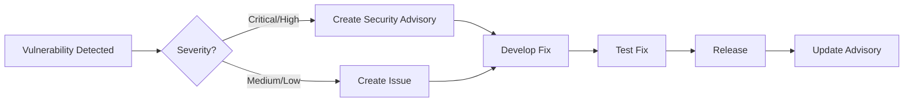

# Security Scanning Documentation

This document describes the security scanning infrastructure implemented for ant-quic.

## Overview

ant-quic employs multiple layers of automated security scanning to ensure the safety and integrity of the codebase and its dependencies.

## Security Tools

### 1. cargo-audit

**Purpose**: Scans for known security vulnerabilities in dependencies

**Features**:
- Daily automated scans
- RUSTSEC advisory database integration
- SARIF output for GitHub Security tab
- PR blocking on vulnerabilities

**Usage**:
```bash
# Run locally
cargo install cargo-audit
cargo audit

# Generate JSON report
cargo audit --json > audit-report.json
```

### 2. cargo-deny

**Purpose**: Enforces security and license policies

**Features**:
- License compliance checking
- Banned dependency enforcement
- Source repository validation
- Duplicate dependency detection

**Configuration**: See `deny.toml`

**Usage**:
```bash
# Install
cargo install cargo-deny

# Check all policies
cargo deny check

# Check specific policy
cargo deny check licenses
cargo deny check advisories
cargo deny check bans
```

### 3. cargo-vet

**Purpose**: Supply chain security verification

**Features**:
- Cryptographic attestations
- Dependency audit trail
- Trust relationship management

**Usage**:
```bash
# Install
cargo install cargo-vet

# Initialize
cargo vet init

# Check supply chain
cargo vet
```

### 4. Dependabot

**Purpose**: Automated dependency updates

**Features**:
- Weekly update checks
- Security update prioritization
- Grouped minor/patch updates
- PR automation

**Configuration**: See `.github/dependabot.yml`

## CI/CD Integration

### Security Workflow

The main security workflow (`.github/workflows/security.yml`) runs:

1. **On every PR**: Basic security checks
2. **On merge**: Full security scan
3. **Daily**: Comprehensive vulnerability scan
4. **Weekly**: Supply chain verification

### Workflow Jobs

1. **vulnerability-scan**
   - Runs cargo-audit
   - Generates SARIF reports
   - Uploads to GitHub Security tab

2. **policy-check**
   - Enforces cargo-deny policies
   - Checks licenses, bans, sources
   - Fails on policy violations

3. **supply-chain**
   - Verifies dependency integrity
   - Generates SBOM
   - Checks for typosquatting

4. **scorecard**
   - OSSF Security Scorecard
   - Best practices evaluation
   - Security metrics

### PR Security Gates

Pull requests must pass:

1. **Dependency Review**: No new vulnerabilities
2. **License Check**: Only approved licenses
3. **Supply Chain**: Verified sources
4. **Policy Compliance**: No banned dependencies

## Security Reports

### GitHub Security Tab

- Vulnerability alerts
- Dependabot alerts
- Code scanning results
- Security advisories

### Artifacts

Each security scan generates artifacts:

- `audit-results.json`: Vulnerability details
- `audit-results.sarif`: GitHub integration
- `sbom.spdx.json`: Software Bill of Materials
- `security-report.md`: Summary report

## Local Development

### Pre-commit Checks

```bash
# Install pre-commit hooks
./scripts/install-hooks.sh

# Manual security check
make security-check
```

### Security Commands

```bash
# Run all security checks
make security

# Run specific checks
make audit
make deny
make licenses
```

## Responding to Vulnerabilities

### Severity Levels

1. **Critical**: Immediate action required
2. **High**: Fix within 7 days
3. **Medium**: Fix within 30 days
4. **Low**: Next release

### Process

1. **Detection**: Automated scanning
2. **Triage**: Assess impact
3. **Fix**: Update or patch
4. **Verify**: Re-run scans
5. **Deploy**: Release update

### Vulnerability Workflow



## Security Policies

### Dependencies

1. **Minimize Dependencies**: Only essential
2. **Trusted Sources**: crates.io preferred
3. **Version Pinning**: Lock file committed
4. **Regular Updates**: Weekly Dependabot

### Licenses

**Allowed**:
- MIT, Apache-2.0, BSD variants
- MPL-2.0, ISC, CC0-1.0

**Denied**:
- GPL, LGPL, AGPL (all versions)

### Banned Crates

- `openssl`: Use rustls instead
- Deprecated crates
- Unmaintained crates

## Best Practices

### For Contributors

1. **Check Before Adding**: Verify new dependencies
2. **Update Regularly**: Keep dependencies current
3. **Report Issues**: Security concerns to security@maidsafe.net
4. **Follow Policy**: Respect deny.toml rules

### For Maintainers

1. **Review Alerts**: Check daily
2. **Prioritize Security**: Fix vulnerabilities first
3. **Document Changes**: Update SECURITY.md
4. **Coordinate Disclosure**: For critical issues

## Monitoring

### Dashboards

- GitHub Security Overview
- Dependency graph
- Vulnerability timeline

### Alerts

- Email notifications
- GitHub notifications
- Slack integration (if configured)

## Compliance

Our security scanning helps meet:

- **NIST Guidelines**: Vulnerability management
- **OWASP Standards**: Dependency checking
- **Supply Chain**: SLSA Level 2+

## Tools Installation

```bash
# Install all security tools
cargo install cargo-audit cargo-deny cargo-vet cargo-license cargo-outdated

# Update tools
cargo install --force cargo-audit cargo-deny cargo-vet
```

## Troubleshooting

### Common Issues

1. **False Positives**: Add to ignore list in deny.toml
2. **Build Failures**: Check policy violations
3. **Slow Scans**: Use caching in CI

### Getting Help

- Documentation: This file
- Issues: GitHub issues
- Security: security@maidsafe.net

## Future Improvements

1. **Fuzzing Integration**: OSS-Fuzz
2. **SAST Tools**: CodeQL expansion
3. **Container Scanning**: Docker images
4. **Compliance Reports**: Automated generation

## References

- [RUSTSEC Advisory Database](https://rustsec.org/)
- [cargo-audit Documentation](https://docs.rs/cargo-audit/)
- [cargo-deny Documentation](https://embarkstudios.github.io/cargo-deny/)
- [GitHub Security Features](https://docs.github.com/en/code-security)