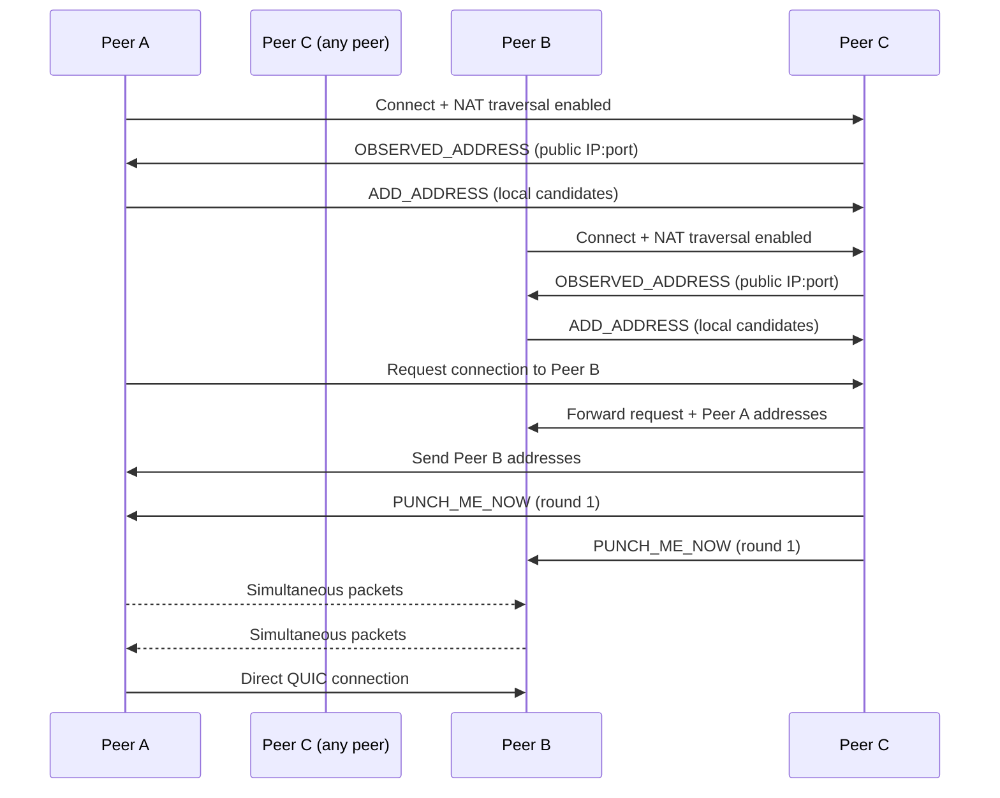

# ant-quic Protocol Extensions

This document describes the QUIC protocol extensions implemented in ant-quic for NAT traversal and address discovery.

## Overview

ant-quic implements the following IETF drafts and custom extensions:

1. **draft-ietf-quic-address-discovery-00** - QUIC Address Discovery
2. **draft-seemann-quic-nat-traversal-02** - QUIC NAT Traversal
3. Custom extensions for enhanced P2P connectivity

**v0.13.0+: Symmetric P2P Architecture**
- All nodes have identical capabilities
- Any peer can observe addresses and coordinate NAT traversal
- No client/server/bootstrap role distinctions

## Transport Parameters

### NAT Traversal Parameters

Negotiates NAT traversal capabilities during the handshake:

```
nat_traversal_capability (0x3d7e9f0bca12fea6): {
    value: varint,  // 1 = enabled, 0 = disabled
}

rfc_nat_traversal_frames (0x3d7e9f0bca12fea8): {
    value: varint,  // 1 = RFC-compliant frame format
}
```

### Address Discovery Parameters

Configure address discovery behavior:

```
address_discovery_config (0x9f81a176): {
    value: varint,  // Configuration flags
}
```

## Extension Frames

### OBSERVED_ADDRESS Frame (Type=0x9f81a6 IPv4, 0x9f81a7 IPv6)

Informs the peer of their observed network address as seen by the sender.

#### Frame Structure

```
OBSERVED_ADDRESS Frame {
    Type (i) = 0x9f81a6 (IPv4) or 0x9f81a7 (IPv6),
    Sequence Number (i),
    IP Address (32 for IPv4, 128 for IPv6),
    Port (16),
}
```

#### Fields

- **Type**: Frame type identifier (0x9f81a6 for IPv4, 0x9f81a7 for IPv6)
- **Sequence Number**: Monotonically increasing counter for ordering
- **IP Address**: 4 bytes for IPv4, 16 bytes for IPv6
- **Port**: UDP port number (network byte order)

#### Usage Example

```rust
// Sending an observed address
connection.send_observed_address(
    peer_addr.ip(),
    peer_addr.port(),
    sequence_num
)?;

// Receiving handler
match frame {
    Frame::ObservedAddress { ip, port, sequence } => {
        if sequence > last_sequence {
            update_reflexive_address(ip, port);
            last_sequence = sequence;
        }
    }
}
```

### ADD_ADDRESS Frame (Type=0x3d7e90 IPv4, 0x3d7e91 IPv6)

Advertises additional addresses where the sender can be reached.

#### Frame Structure

```
ADD_ADDRESS Frame {
    Type (i) = 0x3d7e90 (IPv4) or 0x3d7e91 (IPv6),
    Address ID (i),
    IP Address (32 for IPv4, 128 for IPv6),
    Port (16),
    Priority (i),
}
```

#### Fields

- **Address ID**: Unique identifier for this address
- **Priority**: Higher values = preferred candidates

### PUNCH_ME_NOW Frame (Type=0x3d7e92 IPv4, 0x3d7e93 IPv6)

Coordinates simultaneous hole punching attempts.

#### Frame Structure

```
PUNCH_ME_NOW Frame {
    Type (i) = 0x3d7e92 (IPv4) or 0x3d7e93 (IPv6),
    Round ID (i),
    Target Address Count (i),
    Target Addresses [...] {
        Address ID (i),
        Delay Microseconds (i),
    },
    Coordination Token (64),
}
```

#### Coordination Protocol (Symmetric P2P)

1. **Peer A** wants to connect to Peer B
2. **Any connected peer C** coordinates by forwarding addresses
3. **Peer C** sends PUNCH_ME_NOW to both A and B with timing
4. Both peers simultaneously send packets after specified delay
5. Success reported via ADD_ADDRESS frame

### REMOVE_ADDRESS Frame (Type=0x3d7e94)

Removes a previously advertised address.

#### Frame Structure

```
REMOVE_ADDRESS Frame {
    Type (i) = 0x3d7e94,
    Address ID (i),
}
```

## NAT Traversal Protocol

### Overview

The NAT traversal protocol enables direct peer-to-peer connections through various NAT types without requiring STUN/TURN servers.

### Symmetric P2P Model (v0.13.0+)

All nodes have identical capabilities:
- **Connect**: Initiate connections to other peers
- **Accept**: Accept incoming connections from peers
- **Observe**: See external addresses of connecting peers
- **Report**: Send OBSERVED_ADDRESS frames to peers
- **Coordinate**: Help two other peers establish a connection
- **Relay**: Forward traffic when direct connection fails

There are no special roles - any peer can perform any function.

### Connection Establishment Flow



### Candidate Types and Priority

Candidates are prioritized using a formula similar to ICE:

```
priority = (2^24 * type_preference) +
           (2^8 * local_preference) +
           (256 - component_id)
```

Type preferences:
- Local: 126
- Server Reflexive: 100
- Relayed: 10
- Predicted: 5

### Symmetric NAT Handling

For symmetric NATs, ant-quic implements port prediction:

1. **Linear Prediction**: Assumes sequential port allocation
2. **Delta Prediction**: Based on observed port differences
3. **Range Prediction**: Tests a range around predicted port

Example:
```rust
// Predict next port for symmetric NAT
let predicted_ports = predict_symmetric_ports(
    observed_ports,  // Historical observations
    target_addr,     // Destination address
    strategy         // PredictionStrategy
);

// Add predicted candidates
for port in predicted_ports {
    add_candidate(CandidateAddress {
        addr: SocketAddr::new(public_ip, port),
        source: CandidateSource::Predicted,
        priority: calculate_priority(CandidateSource::Predicted),
    });
}
```

## Security Considerations

### Address Validation

Observed addresses MUST be validated to prevent address spoofing:

1. **Token Validation**: Include cryptographic token in OBSERVED_ADDRESS
2. **Rate Limiting**: Limit frequency of address updates
3. **Source Verification**: Only accept from established connections

### Amplification Prevention

To prevent amplification attacks:

1. Limit response size to request size
2. Require established connection for NAT traversal
3. Rate limit hole punching attempts

### Privacy Considerations

1. **Address Disclosure**: Only share addresses with authorized peers
2. **Metadata Protection**: Encrypt coordination messages
3. **Timing Attacks**: Add random jitter to hole punching

## Implementation Notes

### Frame Parsing

```rust
impl Frame {
    pub fn parse(input: &mut impl Buf) -> Result<Self, FrameError> {
        let frame_type = input.get_var()?;

        match frame_type {
            0x3d7e90 | 0x3d7e91 => parse_add_address(input, frame_type),
            0x3d7e92 | 0x3d7e93 => parse_punch_me_now(input, frame_type),
            0x3d7e94 => parse_remove_address(input),
            0x9f81a6 | 0x9f81a7 => parse_observed_address(input, frame_type),
            _ => Err(FrameError::UnknownType(frame_type)),
        }
    }
}
```

### State Management

```rust
struct NatTraversalState {
    // v0.13.0+: No role field - all peers are symmetric
    candidates: HashMap<u64, CandidateAddress>,
    observed_addresses: VecDeque<ObservedAddress>,
    coordination_rounds: HashMap<u64, CoordinationRound>,
    peer_candidates: HashMap<PeerId, Vec<CandidateAddress>>,
}
```

### Concurrency Considerations

1. **Thread Safety**: Use Arc<Mutex<>> for shared state
2. **Async Operations**: Non-blocking candidate discovery
3. **Timeout Handling**: Configurable timeouts for all operations

## Testing

### Unit Tests

```rust
#[test]
fn test_observed_address_frame_encoding() {
    let frame = Frame::ObservedAddress {
        sequence: 42,
        ip: IpAddr::V4(Ipv4Addr::new(192, 168, 1, 1)),
        port: 9000,
    };

    let mut buf = BytesMut::new();
    frame.encode(&mut buf);

    let decoded = Frame::parse(&mut buf.freeze()).unwrap();
    assert_eq!(frame, decoded);
}
```

### Integration Tests

Test against various NAT configurations:

```bash
# Test symmetric NAT traversal
cargo test --test nat_traversal -- symmetric_nat

# Test with packet loss
cargo test --test nat_traversal -- with_loss

# Test all NAT combinations
cargo test --test nat_traversal -- matrix
```

### Compliance Tests

Verify protocol compliance:

```bash
# Run IETF compliance tests
cargo run --bin compliance-test -- \
    --spec draft-ietf-quic-address-discovery-00 \
    --spec draft-seemann-quic-nat-traversal-02
```

## Debugging

### Enable Protocol Logging

```bash
RUST_LOG=ant_quic::frame=trace,ant_quic::connection::nat_traversal=debug \
    cargo run --bin ant-quic
```

### Packet Capture

Extension frames in Wireshark:

1. Filter: `quic.frame_type == 0x3d7e90` (ADD_ADDRESS IPv4)
2. Filter: `quic.frame_type == 0x9f81a6` (OBSERVED_ADDRESS IPv4)
3. Decode as: Custom QUIC frames
4. Export: JSON format for analysis

### Common Issues

1. **No OBSERVED_ADDRESS received**
   - Check transport parameter negotiation
   - Verify both peers support extension

2. **Hole punching fails**
   - Check firewall allows outbound UDP
   - Verify coordinator connectivity
   - Review timing logs

3. **Symmetric NAT issues**
   - Enable port prediction
   - Increase candidate count
   - Consider relay fallback

## Future Extensions

Planned enhancements:

1. **Multi-path Coordination**: Simultaneous attempts on multiple paths
2. **IPv6 Privacy Extensions**: Handle temporary addresses
3. **QUIC Multicast**: One-to-many NAT traversal
4. **Connection Migration**: Maintain connection across NAT changes

## References

- [draft-ietf-quic-address-discovery-00](https://datatracker.ietf.org/doc/draft-ietf-quic-address-discovery/)
- [draft-seemann-quic-nat-traversal-02](https://datatracker.ietf.org/doc/draft-seemann-quic-nat-traversal/)
- [RFC 9000 - QUIC Transport Protocol](https://www.rfc-editor.org/rfc/rfc9000.html)
- [RFC 7250 - Raw Public Keys in TLS](https://www.rfc-editor.org/rfc/rfc7250.html)
