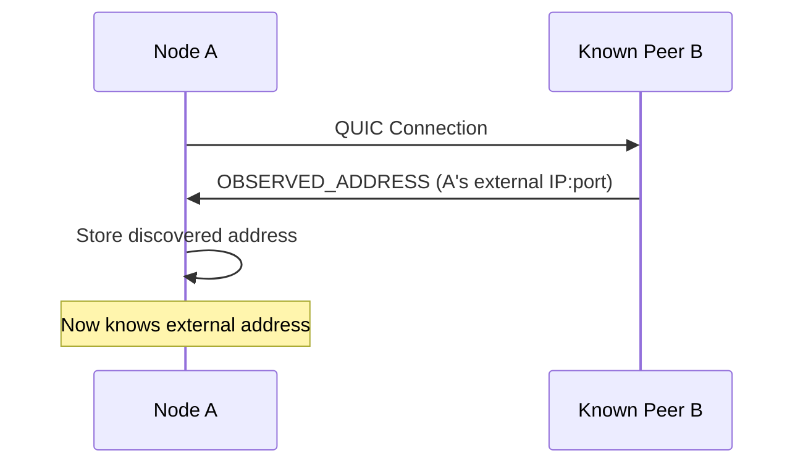

# Architecture

ant-quic has a three-layer architecture designed for modularity and extensibility.

## Overview

```
┌─────────────────────────────────────────┐
│         Applications (Layer 3)          │
│  ant-quic binary, examples, your apps   │
├─────────────────────────────────────────┤
│      Integration APIs (Layer 2)         │
│  P2pEndpoint, P2pConfig (Primary API)   │
├─────────────────────────────────────────┤
│   Protocol Implementation (Layer 1)     │
│  QUIC endpoints, connections, frames    │
│  PQC crypto, NAT traversal extensions   │
└─────────────────────────────────────────┘
```

## Layer 1: Protocol Implementation

The foundation layer implements the QUIC protocol with NAT traversal and PQC extensions:

- **Endpoint** (`src/endpoint.rs`): Core QUIC endpoint management
- **Connection** (`src/connection/`): Connection state machine with NAT traversal
- **Frames** (`src/frame.rs`): QUIC frames including extension frames
- **Crypto** (`src/crypto/`): TLS, Raw Public Keys, and PQC support

### Protocol Extensions

| Extension | Standard | Purpose |
|-----------|----------|---------|
| NAT Traversal | draft-seemann-quic-nat-traversal-02 | Hole punching coordination |
| Address Discovery | draft-ietf-quic-address-discovery-00 | External address detection |
| Raw Public Keys | RFC 7250 | Certificate-free authentication |
| ML-KEM-768 | FIPS 203 | Post-quantum key encapsulation |
| ML-DSA-65 | FIPS 204 | Post-quantum digital signatures |

## Layer 2: Integration APIs

High-level APIs that make ant-quic easy to use:

- **P2pEndpoint** (`src/p2p_endpoint.rs`): Primary user-facing API for P2P networking
- **P2pConfig** (`src/unified_config.rs`): Configuration with builder pattern
- **NatConfig**: NAT traversal tuning options
- **PqcConfig**: Post-quantum cryptography tuning (cannot disable PQC)
- **MtuConfig**: MTU configuration for PQC overhead

### Primary API: P2pEndpoint

```rust
use ant_quic::{P2pEndpoint, P2pConfig};

let config = P2pConfig::builder()
    .known_peer("peer.example.com:9000".parse()?)
    .build()?;

let endpoint = P2pEndpoint::new(config).await?;

// All nodes are symmetric - can connect AND accept
let conn = endpoint.connect(target).await?;
let incoming = endpoint.accept().await;
```

## Layer 3: Applications

User-facing applications and tools:

- **ant-quic binary** (`src/bin/ant-quic.rs`): Main executable
- **Examples** (`examples/`): Demo applications
- **Your applications**: Built on top of the P2pEndpoint API

## Symmetric P2P Model

In ant-quic v0.13.0+, all nodes are symmetric:

```
┌─────────────┐     ┌─────────────┐     ┌─────────────┐
│   Node A    │◄───►│   Node B    │◄───►│   Node C    │
│ (NAT'd)     │     │ (Public IP) │     │ (NAT'd)     │
└─────────────┘     └─────────────┘     └─────────────┘
      │                   │                   │
      └─────────── All Identical ─────────────┘
```

Every node can:
- **Connect** to other nodes (initiate QUIC connections)
- **Accept** connections from other nodes
- **Observe** external addresses of connecting peers
- **Coordinate** NAT traversal for peers
- **Relay** traffic when direct connection fails

There are no special roles (no "bootstrap", "coordinator", "server", "client"). The terms "known peers" refers to addresses you connect to first for address discovery.

## Security Architecture

### Always-On PQC

Every connection uses hybrid cryptography:

```
┌─────────────────┐     ┌─────────────────┐
│   Classical     │     │  Post-Quantum   │
├─────────────────┤     ├─────────────────┤
│    X25519       │  +  │   ML-KEM-768    │ = Hybrid Key Exchange
│    Ed25519      │  +  │   ML-DSA-65     │ = Hybrid Signatures
└─────────────────┘     └─────────────────┘
```

Both algorithm families must be broken to compromise security.

### Raw Public Keys

Identity is based on Ed25519 keys without certificates:

```rust
use ant_quic::key_utils::{generate_ed25519_keypair, derive_peer_id};

let (private_key, public_key) = generate_ed25519_keypair();
let peer_id = derive_peer_id(&public_key);
```

## Key Design Principles

1. **Symmetric**: All nodes are equal - no special infrastructure required
2. **Secure by Default**: 100% PQC on every connection
3. **Modular**: Each layer can be used independently
4. **Extensible**: Easy to add new features
5. **Performant**: Zero-cost abstractions where possible
6. **Testable**: Comprehensive test coverage at each layer

## Data Flow

### Connection Establishment

1. **Discovery**: Connect to known peers, receive OBSERVED_ADDRESS frames
2. **Candidate Exchange**: Share candidate addresses via ADD_ADDRESS frames
3. **Coordination**: Synchronize hole punching via PUNCH_ME_NOW frames
4. **Connection**: Establish direct QUIC connection with PQC handshake
5. **Validation**: Verify peer identity via Raw Public Keys

### Address Discovery



## References

- [Protocol Extensions](./protocol-extensions.md)
- [NAT Traversal](./nat-traversal.md)
- [Security](./security.md)
- [API Reference](./api-reference.md)
