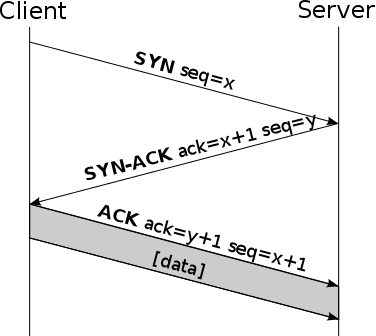

# Problems of TCP 

In [the previous section](transport-protocols.md) we compared TCP with UDP, now the golden question: 
Why should we prefer one over the other? 
One might ask: "Why choose so much uncertainty with UDP when TCP is so reliable and safe?". 
That's a good question to ask yourself. 
To answer that question we will have to delve a little deeper into how TCP works. 

## Head-of-line Blocking

One of the biggest problem/feature in the TCP protocol is the Head-of-line blocking. 
It is a convenient feature because it ensures that all packages are sent and arrive in [order][order]. 
However, in cases of high throughput (multiplayer game networking) and big load in short time (web page load) this can be catastrophic to your application performance.

Lets check this animation to demonstrate the issue:

![Head of line blocking][animation] 

This animation shows that if a certain packet drops in transmission, all packets have to wait at the transport layer until it is resent by the other end.
If the dropped packet is resent and arrived then all packets are freed from the transport layer. 

Lets look at two areas were this head-of-line blocking issue is a huge deal.

**Multiplayer Game Networking**

Multiplayer action games are based on a constant stream of packets sent at a speed of 10 to 30 packets per second.
For the most part, the data in these packages are so time-sensitive that only the most recent data is useful.
You can think of the input and position of the player, the orientation and speed, and the state of the physical objects in the world.
If a single packet drops out we can not afford to queue up 10-30 packets a second until the lost packet is retransmitted. 
This could cause annoying lag behaviour and bad user experience. 

**Web Networking**

Gamenetworking is not the only area were this head-of-line blocking is a big issue.
The World Wide Web is a place were quick web-page load speeds are very important (who wants to wait 200ms to long right?).
As websites get bigger and attention decreases, we need faster loading times for websites.

HTTP-2 introduced technique called multiplexing. 
In short, this means that multiple TCP streams will be setup to communicate with the server if a website loads. 
Then If one of them blocks the whole website can continue to load seemingly while that single stream is retransmitting.

We will take a deeper dive into this subject when looking at QUIC multiplexing.
    
## Connection Setup Duration

In standard HTTP+TLS+TCP stack, TCP needs a handshake to establish a session between server and client, and TLS needs its own handshake to ensure that the session is secured.

First, the source sends an 'SYN initial request' packet to the target server in order to start the dialogue. 
Then the target server sends a 'SYN-ACK packet' to agree to the process.
Lastly, the source sends an 'ACK packet' to the target to confirm the process, after which the message exchange can start. 
 
Now if we want to secure the TCP connection, we have to use a protocol like TLS on top of it. 
If we use an older TLS version < 1.3 then there are three more handshake messages required.

You can see how expensive it is to create a secure TCP connection. 
In a scenario of TCP and TLS 1.2 with a 100ms latency we need to wait 6 x 100ms = 600ms to set up a connection. 
If the website is big in size, an additional load time can make the website load over a second. 
This, of course, is disturbing for our short attention spans. 

## Requests in Segment

A TCP segment can only carry a single HTTP/1.1 Request/Response. 
Consequently it is possible that a large number of small segments are sent within
an HTTP/1.1 session which can lead to overhead.

## Client Connection Initiation

HTTP/1.1 transfers are always initiated by the client. 
This decreases the performance of HTTP/1.1 significantly when loading embedded files, because a server has to
wait for a request from the client, even if the server knows
that the client needs a specific resource.

[order]: transport-guarantees.md#ordering-vs-sequencing
[reliable-ordered]: transport-guarantees.md#reliable-ordered
[internet-protocol-suite]: https://en.wikipedia.org/wiki/Internet_protocol_suite
[animation]: ../images/hol.gif
[website-trend]: ../images/website-size-trend.png