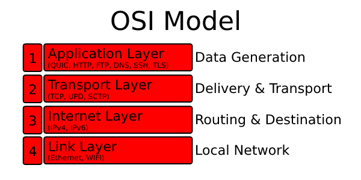

# Transport Protocols

In the previous chapter we looked at transport guarantees, 
in this chapter we will apply it to UDP and TCP and look trought that light on their differences. 
  
For this chapter we will be using the [Internet protocol suite][internet-protocol-suite] as a guidance. 

## IP - Internet Layer

All communication over the internet is happening ontop of IP (Internet Protocol). 
The internet protocol works by splitting data into little chunks called datagrams or packets. 
The chunks are then sent across the internet from one IP address to another.
However, this protocol transfers packets across the network without any guarantee and it is by nature [unreliable][guarantees].
Therefore we need certain [specific guarantees][guarantees]. 
This is exactly were transport protocols, like TCP, UPD come in. 

## Difference Application and Transport Layer

Different layers serve different use cases. 
For example, the application layer is not responsible for the data transfer while the transport layer is. 
Both TCP and UDP work on the transport layer while a protocol like QUIC works on the application layer.  
This means that QUIC defines 'application' logic on top of UDP and that UDP is responsible for the 'transport' of data. 

The advantage of an application protocol is that adoption and development can go faster. 
The reason for this is that hardware devices do not need updates, 
because routers, firewalls, and servers see QUIC packages as UDP packages.

## TCP/IP and UDP Comparison - Transport layer

**TCP:** stands for 'transmission control protocol' and adds certain guarantees ontop of [IP](#ip). 
It forms the backbone for almost everything you do online, from web browsing to IRC to email to file transfer.
The protocol is [reliable ordered][guarantees] in nature.

**UDP** stands for 'user datagram protocol'  and adds certain guarantees ontop of [IP](#ip), but unlike TCP, 
instead of adding lots of features and complexity, UDP is a very thin layer over IP and is also [unreliable][guarantees] in nature.

| Feature |  TCP  | UDP |
| :-------------: | :-------------: | :-------------:    |
|  [Connection-Oriented][connection-oriented]  |       Yes                              |      No                       |
|  [Transport Guarantees][transport-guarantees] | [Reliable Ordered][guarantees]   |      [Unreliable][guarantees] |
|  Packet Transfer                             | [Stream-based][stream-based]           |      Message based            |
|  Automatic [fragmentation][ip-fragmentation] | Yes                                    |      Yes, but better is to stay below datagram size limit |
|  Header Size                                 |  20 bytes                              |      8 bytes                  |
|  [Control Flow, Congestion Avoidance/Control][congestion-control] | Yes               |      No                       |                                            

 

Now we know the differences between UDP and TCP more clearl we can go and at take a go at the [flaws of TCP](tcp-problems.md). 

[internet-protocol-suite]: https://en.wikipedia.org/wiki/Internet_protocol_suite
[stream-based]: https://en.wikipedia.org/wiki/Stream_(computing)
[congestion-control]: https://en.wikipedia.org/wiki/TCP_congestion_control
[connection-oriented]: https://en.wikipedia.org/wiki/Connection-oriented_communication
[ip-fragmentation]: https://en.wikipedia.org/wiki/IP_fragmentation
[guarantees]: transport-guarantees.md#the-5-transport-guarantees
[transport-guarantees]: transport-guarantees.md