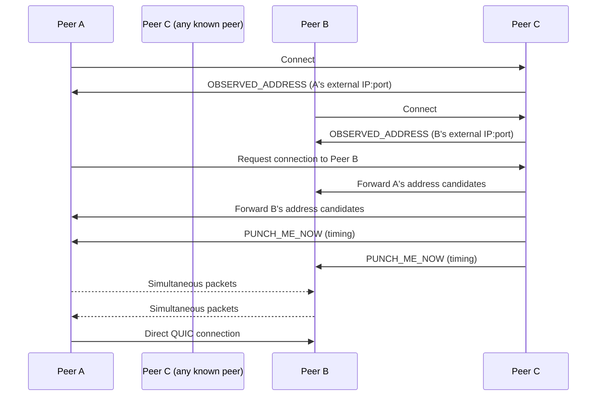

# NAT Traversal Integration Guide

This guide explains how to integrate ant-quic's NAT traversal capabilities into your application using the v0.13.0+ symmetric P2P architecture.

## Table of Contents
1. [Overview](#overview)
2. [Basic Integration](#basic-integration)
3. [Configuration Options](#configuration-options)
4. [Address Discovery](#address-discovery)
5. [Connection Establishment Flow](#connection-establishment-flow)
6. [Event Handling](#event-handling)
7. [Best Practices](#best-practices)
8. [Performance Optimization](#performance-optimization)

## Overview

ant-quic v0.13.0+ provides NAT traversal through native QUIC protocol extensions:

- **QUIC-native NAT traversal** (draft-seemann-quic-nat-traversal-02)
- **QUIC Address Discovery** (draft-ietf-quic-address-discovery-00)
- **ICE-like candidate pairing** for optimal path selection
- **Coordinated hole punching** for symmetric NATs

### Key Concepts

**Symmetric P2P Model**: All nodes are identical. Every node can:
- Initiate connections (like a "client")
- Accept connections (like a "server")
- Observe external addresses of connecting peers
- Coordinate NAT traversal for other peers
- Relay traffic when direct connection fails

**No Special Roles**: There are no "bootstrap nodes" as special infrastructure. The term "known peers" refers to addresses you connect to first for address discovery.

**100% PQC**: All connections use Post-Quantum Cryptography (ML-KEM-768 + ML-DSA-65) by default.

## Basic Integration

### Step 1: Create a P2P Endpoint

```rust
use ant_quic::{P2pEndpoint, P2pConfig, NatConfig};
use std::time::Duration;

#[tokio::main]
async fn main() -> anyhow::Result<()> {
    // Configure P2P endpoint
    let config = P2pConfig::builder()
        // Connect to known peers for address discovery
        .known_peer("peer1.example.com:9000".parse()?)
        .known_peer("peer2.example.com:9000".parse()?)
        // NAT traversal configuration
        .nat(NatConfig {
            max_candidates: 10,
            coordination_timeout: Duration::from_secs(15),
            discovery_timeout: Duration::from_secs(5),
            enable_symmetric_nat: true,
            ..Default::default()
        })
        .build()?;

    // Create endpoint
    let endpoint = P2pEndpoint::new(config).await?;

    // Your peer ID is automatically generated from your Ed25519 key
    println!("My Peer ID: {:?}", endpoint.peer_id());

    // Connect to known peers to learn your external address
    endpoint.connect_bootstrap().await?;

    // Check your discovered external address
    if let Some(addr) = endpoint.external_address() {
        println!("External address: {}", addr);
    }

    Ok(())
}
```

### Step 2: Connect to Peers

```rust
use ant_quic::PeerId;

// Connect to a peer by their address
let connection = endpoint.connect("192.168.1.100:9000".parse()?).await?;

// Or connect to a peer by their ID through a known peer
let peer_id = PeerId::from_hex("abcd1234...")?;
let connection = endpoint.connect_via_peer(peer_id, known_peer_addr).await?;

// Send data on the connection
let (mut send, mut recv) = connection.open_bi().await?;
send.write_all(b"Hello, peer!").await?;
send.finish()?;

// Receive response
let response = recv.read_to_end(1024).await?;
println!("Response: {:?}", response);
```

## Configuration Options

### P2pConfig Builder

```rust
use ant_quic::{P2pConfig, NatConfig, MtuConfig, PqcConfig};

let config = P2pConfig::builder()
    // Bind address (optional)
    .bind_addr("0.0.0.0:9000".parse()?)

    // Known peers for initial connections
    .known_peer("peer1.example.com:9000".parse()?)
    .known_peer("peer2.example.com:9000".parse()?)

    // NAT traversal tuning
    .nat(NatConfig {
        max_candidates: 10,
        coordination_timeout: Duration::from_secs(15),
        discovery_timeout: Duration::from_secs(5),
        enable_symmetric_nat: true,
        hole_punch_retries: 5,
        ..Default::default()
    })

    // MTU configuration for PQC
    .mtu(MtuConfig {
        initial: 1200,
        min: 1200,
        max: 1500,
    })

    // PQC tuning (always enabled)
    .pqc(PqcConfig::builder()
        .ml_kem(true)
        .ml_dsa(true)
        .memory_pool_size(10)
        .build()?)

    // Connection limits
    .max_connections(100)

    .build()?;
```

### NatConfig Parameters

| Parameter | Type | Default | Description |
|-----------|------|---------|-------------|
| `max_candidates` | `usize` | `10` | Maximum address candidates per peer |
| `coordination_timeout` | `Duration` | `15s` | Timeout for hole punch coordination |
| `discovery_timeout` | `Duration` | `5s` | Timeout for candidate discovery |
| `enable_symmetric_nat` | `bool` | `true` | Enable port prediction for symmetric NAT |
| `hole_punch_retries` | `u32` | `5` | Number of hole punch attempts |

## Address Discovery

### How It Works

Any connected peer can observe your external address and report it back:

1. **You connect** to a peer
2. **Peer observes** your source address from incoming packets
3. **Peer sends** OBSERVED_ADDRESS frame (0x9f81a6 IPv4, 0x9f81a7 IPv6)
4. **You learn** your external address without STUN servers

This is defined in draft-ietf-quic-address-discovery-00.

### Monitoring Discovered Addresses

```rust
// Get all discovered external addresses
let addresses = endpoint.discovered_addresses();
for addr in addresses {
    println!("Discovered address: {}", addr);
}

// Subscribe to address change events
let mut events = endpoint.subscribe();
while let Ok(event) = events.recv().await {
    match event {
        P2pEvent::AddressDiscovered { addr } => {
            println!("New external address: {}", addr);
        }
        P2pEvent::AddressChanged { old, new } => {
            println!("Address changed: {} -> {}", old, new);
        }
        _ => {}
    }
}
```

### Integration with NAT Traversal

Discovered addresses automatically become high-priority candidates:

```rust
// Get local candidates including discovered addresses
let candidates = endpoint.get_local_candidates();
for candidate in candidates {
    match candidate.source {
        CandidateSource::Observed => {
            println!("QUIC-discovered address: {} (high priority)", candidate.addr);
        }
        CandidateSource::Local => {
            println!("Local interface: {}", candidate.addr);
        }
        CandidateSource::Predicted => {
            println!("Symmetric NAT prediction: {}", candidate.addr);
        }
    }
}
```

## Connection Establishment Flow

### Symmetric P2P Connection



### Complete Flow Example

```rust
use ant_quic::{P2pEndpoint, P2pConfig, P2pEvent};

#[tokio::main]
async fn main() -> anyhow::Result<()> {
    // Create P2P endpoint
    let config = P2pConfig::builder()
        .known_peer("quic.saorsalabs.com:9000".parse()?)
        .build()?;

    let endpoint = P2pEndpoint::new(config).await?;

    // 1. Connect to known peer and discover external address
    endpoint.connect_bootstrap().await?;
    println!("External address: {:?}", endpoint.external_address());

    // 2. Subscribe to events
    let mut events = endpoint.subscribe();

    // 3. Accept incoming connections or initiate outbound
    tokio::spawn(async move {
        while let Ok(event) = events.recv().await {
            match event {
                P2pEvent::Connected { peer_id, addr } => {
                    println!("Connected to {} at {}", peer_id.to_hex(), addr);
                }
                P2pEvent::ConnectionFailed { peer_id, reason } => {
                    println!("Failed to connect to {}: {}", peer_id.to_hex(), reason);
                }
                P2pEvent::HolePunchStarted { peer_id } => {
                    println!("Hole punching with {}", peer_id.to_hex());
                }
                P2pEvent::HolePunchSucceeded { peer_id, addr } => {
                    println!("Direct connection to {} at {}", peer_id.to_hex(), addr);
                }
                _ => {}
            }
        }
    });

    // 4. Connect to a specific peer
    let target = "192.168.1.100:9000".parse()?;
    let connection = endpoint.connect(target).await?;
    println!("Connection established!");

    Ok(())
}
```

## Event Handling

### P2pEvent Types

```rust
use ant_quic::P2pEvent;

let mut events = endpoint.subscribe();
while let Ok(event) = events.recv().await {
    match event {
        // Connection events
        P2pEvent::Connected { peer_id, addr } => {
            println!("Connected: {} at {}", peer_id.to_hex(), addr);
        }
        P2pEvent::Disconnected { peer_id, reason } => {
            println!("Disconnected: {} - {}", peer_id.to_hex(), reason);
        }
        P2pEvent::ConnectionFailed { peer_id, reason } => {
            println!("Connection failed: {} - {}", peer_id.to_hex(), reason);
        }

        // Address discovery events
        P2pEvent::AddressDiscovered { addr } => {
            println!("Discovered external address: {}", addr);
        }
        P2pEvent::AddressChanged { old, new } => {
            println!("Address changed: {} -> {}", old, new);
        }

        // NAT traversal events
        P2pEvent::HolePunchStarted { peer_id } => {
            println!("Starting hole punch with {}", peer_id.to_hex());
        }
        P2pEvent::HolePunchSucceeded { peer_id, addr } => {
            println!("Hole punch succeeded: {} at {}", peer_id.to_hex(), addr);
        }
        P2pEvent::HolePunchFailed { peer_id, reason } => {
            println!("Hole punch failed: {} - {}", peer_id.to_hex(), reason);
        }

        // Candidate events
        P2pEvent::CandidatesDiscovered { peer_id, count } => {
            println!("Found {} candidates for {}", count, peer_id.to_hex());
        }
    }
}
```

## Best Practices

### 1. Use Multiple Known Peers

```rust
// Multiple known peers improve address discovery reliability
let config = P2pConfig::builder()
    .known_peer("us-east.example.com:9000".parse()?)
    .known_peer("eu-west.example.com:9000".parse()?)
    .known_peer("asia.example.com:9000".parse()?)
    .build()?;
```

### 2. Handle Connection Timeouts

```rust
use tokio::time::timeout;

let connection_timeout = Duration::from_secs(30);

match timeout(connection_timeout, endpoint.connect(target)).await {
    Ok(Ok(connection)) => {
        println!("Connected successfully");
    }
    Ok(Err(e)) => {
        eprintln!("Connection failed: {}", e);
        // Try alternative peers
    }
    Err(_) => {
        eprintln!("Connection timed out");
        // Retry with different parameters
    }
}
```

### 3. Monitor Network Changes

```rust
let mut events = endpoint.subscribe();
while let Ok(event) = events.recv().await {
    match event {
        P2pEvent::AddressChanged { old, new } => {
            println!("Network change: {} -> {}", old, new);
            // Re-establish connections if needed
            // Notify connected peers of address change
        }
        _ => {}
    }
}
```

### 4. Graceful Cleanup

```rust
// Properly close connections when shutting down
endpoint.close_all_connections().await;

// Or close specific connection
connection.close(0u32.into(), b"goodbye").await;
```

## Performance Optimization

### 1. Optimize Candidate Discovery

```rust
let config = P2pConfig::builder()
    .nat(NatConfig {
        max_candidates: 8,       // Reduce from default 10
        discovery_timeout: Duration::from_secs(3), // Faster timeout
        ..Default::default()
    })
    .build()?;
```

### 2. Connection Pooling

```rust
use std::collections::HashMap;
use tokio::sync::RwLock;

struct ConnectionPool {
    connections: RwLock<HashMap<SocketAddr, Connection>>,
}

impl ConnectionPool {
    async fn get_or_create(
        &self,
        endpoint: &P2pEndpoint,
        addr: SocketAddr,
    ) -> anyhow::Result<Connection> {
        // Check existing connection
        if let Some(conn) = self.connections.read().await.get(&addr) {
            if !conn.is_closed() {
                return Ok(conn.clone());
            }
        }

        // Create new connection
        let conn = endpoint.connect(addr).await?;
        self.connections.write().await.insert(addr, conn.clone());
        Ok(conn)
    }
}
```

### 3. Monitoring

```rust
tokio::spawn(async move {
    let mut interval = tokio::time::interval(Duration::from_secs(60));

    loop {
        interval.tick().await;

        // Get statistics
        let stats = endpoint.stats();
        println!("NAT Traversal Stats:");
        println!("  Active connections: {}", stats.active_connections);
        println!("  Discovered addresses: {}", stats.discovered_addresses);
        println!("  Successful hole punches: {}", stats.successful_hole_punches);
        println!("  Failed hole punches: {}", stats.failed_hole_punches);
    }
});
```

## Summary

ant-quic v0.13.0+ NAT traversal provides:
- **Symmetric P2P model** - all nodes are equal
- **Automatic address detection** without STUN servers
- **High success rates** (~90% with address discovery)
- **100% PQC** - quantum-resistant by default
- **Seamless integration** with standard QUIC connections

The system works out-of-the-box with sensible defaults while providing configuration options for advanced use cases.

## References

- [draft-seemann-quic-nat-traversal-02](../../rfcs/draft-seemann-quic-nat-traversal-02.txt)
- [draft-ietf-quic-address-discovery-00](../../rfcs/draft-ietf-quic-address-discovery-00.txt)
- [NAT Traversal Guide](../NAT_TRAVERSAL_GUIDE.md)
- [API Guide](../API_GUIDE.md)
- [Troubleshooting Guide](../TROUBLESHOOTING.md)
